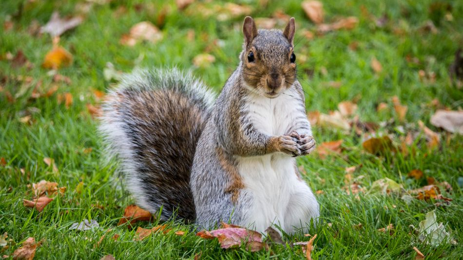
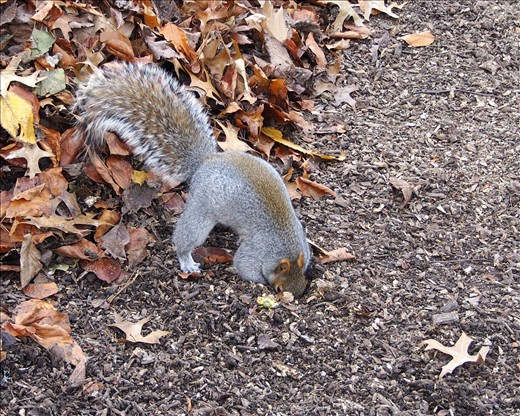
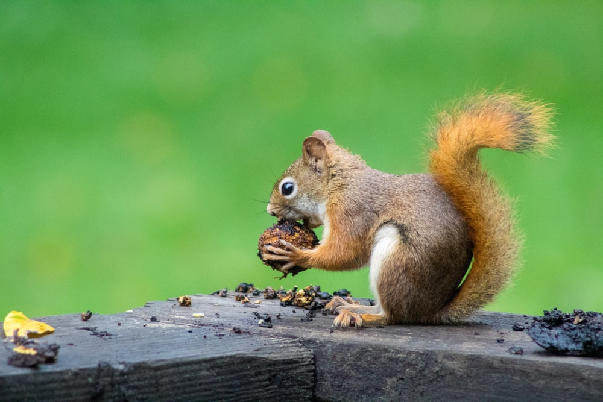
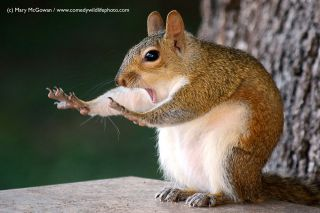

On this website, you will find information about the behaviors and sounds made by squirrels, and their interactions with people, in Central Park in New York City. 

The data that are used are the 2018 Central Park Squirrel Data from NYC Open Data, which can be found here (https://opendata.cityofnewyork.us)  

