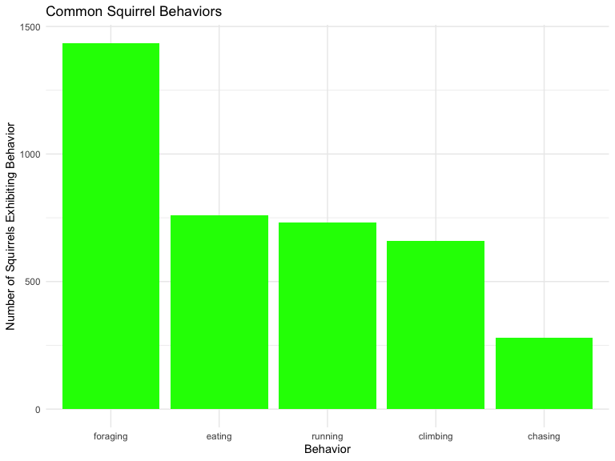

About Central Park Squirrels
================

## Who they are:

There were 3023 unique squirrels spotted in Central Park in October of
2018\!

## What they look like:

Mostly
gray.

## What they do:

Foraging is the most common observed behavior.

